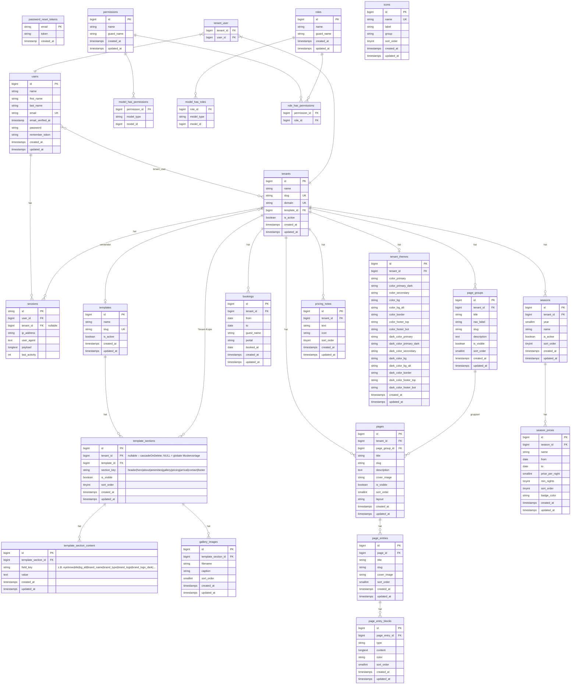

# Datenbankstruktur – Entity Relationship Diagram

```mermaid
erDiagram

    %% ─── Benutzer & Authentifizierung ───────────────────────────────────────
    users {
        bigint id PK
        string name
        string first_name
        string last_name
        string email UK
        timestamp email_verified_at
        string password
        string remember_token
        timestamps created_at
        timestamps updated_at
    }

    password_reset_tokens {
        string email PK
        string token
        timestamp created_at
    }

    sessions {
        string id PK
        bigint user_id FK
        bigint tenant_id FK "nullable"
        string ip_address
        text user_agent
        longtext payload
        int last_activity
    }

    %% ─── Rollen & Berechtigungen (Spatie) ───────────────────────────────────
    permissions {
        bigint id PK
        string name
        string guard_name
        timestamps created_at
        timestamps updated_at
    }

    roles {
        bigint id PK
        string name
        string guard_name
        timestamps created_at
        timestamps updated_at
    }

    model_has_permissions {
        bigint permission_id FK
        string model_type
        bigint model_id
    }

    model_has_roles {
        bigint role_id FK
        string model_type
        bigint model_id
    }

    role_has_permissions {
        bigint permission_id FK
        bigint role_id FK
    }

    %% ─── Mandanten (Multi-Tenancy) ───────────────────────────────────────────
    tenants {
        bigint id PK
        string name
        string slug UK
        string domain UK
        bigint template_id FK
        boolean is_active
        timestamps created_at
        timestamps updated_at
    }

    tenant_user {
        bigint tenant_id FK
        bigint user_id FK
    }

    %% ─── Templates & Inhalte ─────────────────────────────────────────────────
    templates {
        bigint id PK
        string name
        string slug UK
        boolean is_active
        timestamps created_at
        timestamps updated_at
    }

    template_sections {
        bigint id PK
        bigint tenant_id FK "nullable – cascadeOnDelete; NULL = globale Mustervorlage"
        bigint template_id FK
        string section_key "header|hero|about|amenities|gallery|pricing|arrival|contact|footer"
        boolean is_visible
        tinyint sort_order
        timestamps created_at
        timestamps updated_at
    }

    template_section_content {
        bigint id PK
        bigint template_section_id FK
        string field_key "z.B. eyebrow|title|bg_alt|brand_name|brand_type|brand_logo|brand_logo_dark|..."
        text value
        timestamps created_at
        timestamps updated_at
    }

    gallery_images {
        bigint id PK
        bigint template_section_id FK
        string filename
        string caption
        smallint sort_order
        timestamps created_at
        timestamps updated_at
    }

    %% ─── Seiten & Inhaltsblöcke ──────────────────────────────────────────────
    page_groups {
        bigint id PK
        bigint tenant_id FK
        string title
        string nav_label
        string slug
        text description
        boolean is_visible
        smallint sort_order
        timestamps created_at
        timestamps updated_at
    }

    pages {
        bigint id PK
        bigint tenant_id FK
        bigint page_group_id FK
        string title
        string slug
        text description
        string cover_image
        boolean is_visible
        smallint sort_order
        string layout
        timestamps created_at
        timestamps updated_at
    }

    page_entries {
        bigint id PK
        bigint page_id FK
        string title
        string slug
        string cover_image
        smallint sort_order
        timestamps created_at
        timestamps updated_at
    }

    page_entry_blocks {
        bigint id PK
        bigint page_entry_id FK
        string type
        longtext content
        string color
        smallint sort_order
        timestamps created_at
        timestamps updated_at
    }

    %% ─── Buchungen & Preise ──────────────────────────────────────────────────
    bookings {
        bigint id PK
        bigint tenant_id FK
        date from
        date to
        string guest_name
        string portal
        date booked_at
        timestamps created_at
        timestamps updated_at
    }

    seasons {
        bigint id PK
        bigint tenant_id FK
        smallint year
        string name
        boolean is_active
        tinyint sort_order
        timestamps created_at
        timestamps updated_at
    }

    season_prices {
        bigint id PK
        bigint season_id FK
        string name
        date from
        date to
        smallint price_per_night
        tinyint min_nights
        tinyint sort_order
        string badge_color
        timestamps created_at
        timestamps updated_at
    }

    pricing_notes {
        bigint id PK
        bigint tenant_id FK
        string text
        string icon
        tinyint sort_order
        timestamps created_at
        timestamps updated_at
    }

    %% ─── Farbtheme ───────────────────────────────────────────────────────────
    tenant_themes {
        bigint id PK
        bigint tenant_id FK
        string color_primary
        string color_primary_dark
        string color_secondary
        string color_bg
        string color_bg_alt
        string color_border
        string color_footer_top
        string color_footer_bot
        string dark_color_primary
        string dark_color_primary_dark
        string dark_color_secondary
        string dark_color_bg
        string dark_color_bg_alt
        string dark_color_border
        string dark_color_footer_top
        string dark_color_footer_bot
        timestamps created_at
        timestamps updated_at
    }

    %% ─── Sonstiges ───────────────────────────────────────────────────────────
    icons {
        bigint id PK
        string name UK
        string label
        string group
        tinyint sort_order
        timestamps created_at
        timestamps updated_at
    }

    %% ─── Beziehungen ─────────────────────────────────────────────────────────

    %% Auth
    users ||--o{ sessions : "hat"
    tenants ||--o{ sessions : "hat"
    users }o--o{ tenants : "tenant_user"
    tenant_user }|--|| tenants : ""
    tenant_user }|--|| users : ""

    %% Rollen & Berechtigungen
    permissions ||--o{ model_has_permissions : ""
    permissions ||--o{ role_has_permissions : ""
    roles ||--o{ model_has_roles : ""
    roles ||--o{ role_has_permissions : ""

    %% Tenants & Templates
    tenants }o--o| templates : "verwendet"
    tenants ||--o| tenant_themes : "hat"
    tenants ||--o{ bookings : "hat"
    tenants ||--o{ seasons : "hat"
    tenants ||--o{ pricing_notes : "hat"
    tenants ||--o{ page_groups : "hat"
    tenants ||--o{ pages : "hat"

    %% Templates
    templates ||--o{ template_sections : "hat"
    tenants ||--o{ template_sections : "Tenant-Kopie"
    template_sections ||--o{ template_section_content : "hat"
    template_sections ||--o{ gallery_images : "hat"

    %% Seiten
    page_groups ||--o{ pages : "gruppiert"
    pages ||--o{ page_entries : "hat"
    page_entries ||--o{ page_entry_blocks : "hat"

    %% Preise
    seasons ||--o{ season_prices : "hat"
```